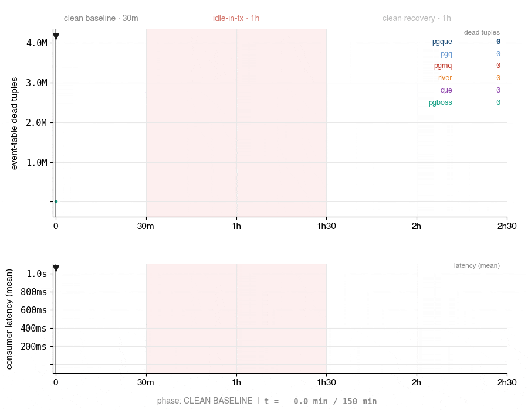

<h1 align="center">PgQue – PgQ, universal edition</h1>

<p align="center"><strong>Zero-bloat Postgres queue. One SQL file to install, <code>pg_cron</code> to tick.</strong></p>

<p align="center">
  <a href="https://github.com/NikolayS/pgque/actions/workflows/ci.yml"></a>
  <a href="https://www.postgresql.org/"></a>
  <a href="LICENSE"></a>
  <a href="https://github.com/citusdata/pg_cron"></a>
  <a href="https://github.com/NikolayS/pgque"></a>
</p>

<p align="center"></p>

## Contents

- [Why PgQue](#why-pgque)
- [Latency trade-off](#latency-trade-off)
- [Comparison](#comparison)
- [Installation](#installation)
- [Roles and grants](#roles-and-grants)
- [Project status](#project-status)
- [Docs](#docs)
- [Quick start](#quick-start)
- [Client libraries](#client-libraries)
- [Benchmarks](#benchmarks)
- [Architecture](#architecture)
- [Contributing](#contributing)
- [License](#license)

PgQue brings back [PgQ](https://github.com/pgq/pgq) — one of the most proven Postgres queue architectures ever built — in a form that fits modern Postgres.

PgQ was designed at Skype to run messaging at 1-billion-user scale, and it lived in very large self-managed Postgres installations for years. Standard PgQ ships as a C extension (`pgq`) plus an external daemon (`pgqd`) — unavailable on most managed Postgres providers.

PgQue rebuilds that same battle-tested engine in pure PL/pgSQL, so the zero-bloat queue pattern works anywhere you can run SQL — without adding another distributed system to your stack.

**The anti-extension.** Pure SQL + PL/pgSQL on any Postgres 14+ — including RDS, Aurora, Cloud SQL, AlloyDB, Supabase, Neon, and every other managed provider. No C extension, no `shared_preload_libraries`, no provider approval, no restart. `\i` and go.

Historical context, two decks worth your time:

- [Marko Kreen (Skype), PGCon 2009 — PgQ](https://www.pgcon.org/2009/schedule/attachments/91_pgq.pdf)
- [Alexander Kukushkin (Microsoft), 2026 — Rediscovering PgQ](https://speakerdeck.com/cyberdemn/rediscovering-pgq)

## Why PgQue

Most Postgres queues rely on `SKIP LOCKED` plus `DELETE` and/or `UPDATE`. That works nicely in toy examples and then quietly turns into dead tuples, VACUUM pressure, index bloat, and performance drift under sustained load.

PgQue avoids that whole class of problems. It uses **snapshot-based batching** and **TRUNCATE-based table rotation** instead of per-row deletion. The hot path stays predictable over time:

- **Zero bloat by design** — no dead tuples in the main queue path
- **No performance decay** — it does not get slower because it has been running for months
- **Built for heavy-loaded systems** — the abuse the original PgQ architecture was made for
- **Real Postgres guarantees** — ACID transactions, transactional enqueue/consume, WAL, backups, replication, SQL visibility
- **Works on managed Postgres** — no custom build, no C extension, no separate daemon

PgQue gives you queue semantics **inside** Postgres, with Postgres durability and transactional behavior, without paying the usual bloat tax most in-database queues eventually pay.

## Latency trade-off

PgQue is built around **snapshot-based batching**, not row-by-row claiming. That's what gives it zero bloat in the hot path, stable behavior under sustained load, and clean ACID semantics inside Postgres.

The trade-off is **end-to-end delivery latency** — the gap between `send` and when a consumer can `receive` the event. In the default configuration, end-to-end delivery is typically measured in **seconds**, not milliseconds, because events become visible on ticks rather than immediately on insert. Per-call latency (`send`, `receive`, `ack` themselves) stays in the microsecond range — see [benchmarks](docs/benchmarks.md).

Ways to reduce delivery latency: tune tick frequency and queue thresholds; use `force_tick()` for tests and demos or to force an immediate batch. Future versions may add logical-decoding-based wake-ups for sub-second delivery without cutting the tick interval.

If your top priority is single-digit-millisecond dispatch, PgQue is probably the wrong hammer. If your priority is **stability under load without bloat**, that's exactly where it gets interesting.

## Comparison

| Feature | PgQue | PgQ | PGMQ | River | Que | pg-boss |
|---|---|---|---|---|---|---|
| Snapshot-based batching (no row locks) | ✅ | ✅ | ❌ | ❌ | ❌ | ❌ |
| Zero bloat under sustained load | ✅ | ✅ | ❌ | ❌ | ❌ | ❌ |
| No external daemon or worker binary | ✅ | ❌ | ✅ | ❌ | ❌ | ❌ |
| Pure SQL install, managed Postgres ready | ✅ | ❌ | ✅ | ✅ | ✅ | ✅ |
| Language-agnostic SQL API | ✅ | ✅ | ✅ | ❌ | ❌ | ❌ |
| Multiple independent consumers (fan-out) | ✅ | ✅ | ❌ | ❌ | ❌ | ✅ |
| Built-in retry with backoff | ✅ | ✅ | ⚠️ | ✅ | ✅ | ✅ |
| Built-in dead letter queue | ✅ | ❌ | ⚠️ | ⚠️ | ❌ | ✅ |

**Legend:** ✅ yes · ❌ no · ⚠️ partial / indirect

**Notes:**

- **[PgQ](https://github.com/pgq/pgq)** is the Skype-era queue engine (~2007) PgQue is derived from. Same snapshot/rotation architecture, but requires C extensions and an external daemon (`pgqd`) — unavailable on managed Postgres. PgQue removes both constraints.
- **No external daemon:** PgQue uses pg_cron (or your own scheduler) for ticking; PGMQ uses visibility timeouts. River, Que, and pg-boss require a Go / Ruby / Node.js worker binary.
- **[Que](https://github.com/que-rb/que)** uses advisory locks (not SKIP LOCKED) — no dead tuples from *claiming*, but completed jobs are still DELETEd. Brandur's [bloat post](https://brandur.org/postgres-queues) was about Que at Heroku. Ruby-only.
- **PGMQ retry** is visibility-timeout re-delivery (`read_ct` tracking) — no configurable backoff or max attempts.
- **pg-boss fan-out** is copy-per-queue `publish()`/`subscribe()`, not a shared event log with independent cursors.
- **Category:** River, Que, and pg-boss (and Oban, graphile-worker, solid_queue, good_job) are **job queue frameworks**. PgQue is an **event/message queue** optimized for high-throughput streaming with fan-out.

### What genuinely differentiates PgQue

**1. Zero event-table bloat, structurally.** SKIP LOCKED queues (PGMQ, River, pg-boss, Oban, graphile-worker) UPDATE + DELETE rows, creating dead tuples that require VACUUM. Under sustained load this causes documented failures:

- [Brandur/Heroku (2015)](https://brandur.org/postgres-queues) — 60k backlog in one hour.
- [PlanetScale (2026)](https://planetscale.com/blog/keeping-a-postgres-queue-healthy) — death spiral at 800 jobs/sec with OLAP on the side.
- [River issue #59](https://github.com/riverqueue/river/issues/59) — autovacuum starvation.

Oban Pro shipped table partitioning to mitigate it; PGMQ ships aggressive autovacuum settings. PgQue's TRUNCATE rotation creates zero dead tuples by construction — no tuning, immune to xmin horizon pinning.

**2. Native fan-out.** Each registered consumer maintains its own cursor on a shared event log and independently receives all events. That's fundamentally different from competing-consumers (SKIP LOCKED) where each job goes to one worker. pg-boss has fan-out but it is copy-per-queue (one INSERT per subscriber per event). PgQue's model is position-in-shared-log — no data duplication, atomic batch boundaries, late subscribers catch up. Closer to Kafka topics than to a job queue.

### When to use PgQue vs. a job queue

PgQue is an **event/message queue**; River, graphile-worker, pg-boss, and Oban are **job queue frameworks** — different categories.

- **Choose PgQue** when you want event-driven fan-out, zero-maintenance bloat behavior, and a language-agnostic SQL API, and you do not need per-job priorities or a worker framework.
- **Choose a job queue** when you need per-job lifecycle, sub-3ms latency, priority queues, cron scheduling, unique jobs, or deep ecosystem integration (Elixir/Go/Node.js/Ruby).

## Installation

**Requirements:** Postgres 14+. `pg_cron` is optional and recommended.

Inside a psql session:

```sql
begin;
\i sql/pgque.sql
commit;
```

Or from the shell, same single-transaction guarantee via `psql --single-transaction`:

```bash
PAGER=cat psql --no-psqlrc --single-transaction -d mydb -f sql/pgque.sql
```

With `pg_cron` installed, `pgque.start()` creates the default ticker and maintenance jobs:

```sql
select pgque.start();
```

Without `pg_cron`, the install still works, but PgQue is not self-running. Drive ticking and maintenance from an external scheduler:

```bash
PAGER=cat psql --no-psqlrc -c "select pgque.ticker()"   # every 1-2 seconds
PAGER=cat psql --no-psqlrc -c "select pgque.maint()"    # every 30 seconds
```

**Important:** PgQue does not deliver messages without a working ticker. Enqueueing still works, but consumers will see nothing new because no ticks are created. If you do not use `pg_cron`, run `pgque.ticker()` and `pgque.maint()` yourself.

Treat installation as initial setup for now — upgrade/reinstall guarantees are still being tightened. To uninstall: `\i sql/pgque_uninstall.sql`.

## Roles and grants

The install creates three roles. Application users do not need superuser — grant them whichever role matches their access pattern.

| Role | Purpose | Granted access |
|---|---|---|
| `pgque_reader` | Dashboards, metrics, debugging | `get_queue_info`, `get_consumer_info`, `get_batch_info`, `version`, plus `select` on all tables |
| `pgque_writer` | Producers and consumers (most apps) | inherits `pgque_reader` + the modern API (`send`, `send_batch`, `subscribe`, `unsubscribe`, `receive`, `ack`, `nack`) and the underlying PgQ primitives (`insert_event`, `next_batch`, `get_batch_events`, `finish_batch`, `event_retry`, `register_consumer`, `unregister_consumer`) |
| `pgque_admin`  | Operators, migrations | inherits `pgque_writer` + full schema/table/sequence access. `uninstall()` is explicitly revoked from `pgque_admin`, but PUBLIC execute is not revoked by default — see [`docs/reference.md`](docs/reference.md) to tighten. |

Typical app setup:

```sql
\i sql/pgque.sql
select pgque.start();                     -- optional pg_cron ticker + maint

create user app_orders with password '...';          -- replace with a real password
grant pgque_writer to app_orders;

create user metrics with password '...';              -- replace with a real password
grant pgque_reader to metrics;
```

DDL-class operations (`create_queue`, `drop_queue`, `start`, `stop`, `maint`, `ticker`, `force_tick`) are not granted to `pgque_writer` and should be performed by an admin / migration role. They currently default to PUBLIC; revoking from PUBLIC and granting only to `pgque_admin` is on the roadmap.

## Project status

PgQue is **early-stage** as a product and API layer. PgQ itself is **rock solid** — battle-tested in very large systems over many years. What's new here is the packaging, modernization, managed-Postgres compatibility, and the higher-level PgQue API around that core.

The default install intentionally stays small in v0.1; additional APIs live under `sql/experimental/` until they are worth promoting. See [blueprints/PHASES.md](blueprints/PHASES.md).

## Docs

- [Tutorial](docs/tutorial.md) — a hands-on walkthrough. Start here if you are new.
- [Reference](docs/reference.md) — every shipped function and role.
- [Examples](docs/examples.md) — patterns: fan-out, exactly-once, batch loading, recurring jobs.
- [Benchmarks](docs/benchmarks.md) — throughput measurements and methodology.
- [PgQ concepts](docs/pgq-concepts.md) — glossary (batch, tick, rotation) for contributors.
- [PgQ history](docs/pgq-history.md) — where this engine came from.

## Quick start

```sql
-- tx 1: create queue + consumer
select pgque.create_queue('orders');
select pgque.subscribe('orders', 'processor');

-- tx 2: send a message
select pgque.send('orders', '{"order_id": 42, "total": 99.95}'::jsonb);

-- tx 3: advance the queue if you are not using pg_cron
-- (force_tick bypasses lag/count thresholds — handy in demos/tests)
select pgque.force_tick('orders');
select pgque.ticker();

-- tx 4: receive (batch_id is the same for every returned row)
select * from pgque.receive('orders', 'processor', 100);

-- tx 5: acknowledge
select pgque.ack(:batch_id);
```

Send, tick, and receive should be separate transactions — that's PgQ's snapshot-based design working as intended. In normal operation, `pg_cron` or an external scheduler drives `pgque.ticker()`; `force_tick()` is mainly for demos, tests, and manual operation.

Longer walkthrough in the [tutorial](docs/tutorial.md); patterns like fan-out, exactly-once, and recurring jobs in [examples](docs/examples.md).

## Client libraries

PgQue is SQL-first, so any Postgres driver works. On top of that, example client libraries exist for **Python**, **Go**, and **TypeScript** — unpublished, still evolving, meant to demonstrate integration patterns rather than promise stable SDKs yet. **Help improving them is very much appreciated.**

### Python (`pgque-py`) — psycopg 3

```python
from pgque import PgqueClient, Consumer

client = PgqueClient(conn)
client.send("orders", {"order_id": 42})

consumer = Consumer(dsn, queue="orders", name="processor", poll_interval=30)

@consumer.on("order.created")
def handle_order(msg):
    process_order(msg.payload)

consumer.start()
```

### Go (`pgque-go`) — pgx/v5

```go
client, _ := pgque.Connect(ctx, "postgresql://localhost/mydb")

consumer := client.NewConsumer("orders", "processor")
consumer.Handle("order.created", func(ctx context.Context, msg pgque.Message) error {
    return processOrder(msg)
})
consumer.Start(ctx)
```

### TypeScript (`pgque-ts`) — node-postgres

```ts
const client = new PgqueClient('postgresql://localhost/mydb');
await client.connect();

await client.send('orders', { order_id: 42 }, 'order.created');
await client.subscribe('orders', 'processor');

const messages = await client.receive('orders', 'processor', 100);
if (messages.length > 0) await client.ack(messages[0].batch_id);
```

### Any language

```sql
select pgque.send('orders', '{"order_id": 42}'::jsonb);
select * from pgque.receive('orders', 'processor', 100);
select pgque.ack(batch_id);
```

## Benchmarks

Preliminary laptop numbers: ~86k ev/s PL/pgSQL insert, ~2.4M ev/s consumer
read rate, zero dead-tuple growth under a 30-minute sustained test. See
[docs/benchmarks.md](docs/benchmarks.md) for the full table and methodology.
Server-class numbers to follow.

## Architecture

PgQue keeps PgQ's proven core architecture — snapshot-based batch isolation, three-table TRUNCATE rotation on the hot path, separate retry / delayed / dead-letter tables, and independent per-consumer cursors — and adds a modern API layer on top. See [blueprints/SPECx.md](blueprints/SPECx.md) for the full specification and [docs/pgq-concepts.md](docs/pgq-concepts.md) for the batch/tick/rotation glossary.

## Contributing

See [blueprints/SPECx.md](blueprints/SPECx.md) for the specification and implementation plan. New code should follow red/green TDD: write the failing test first, then fix it.

## License

Apache-2.0. See [LICENSE](LICENSE).

PgQue includes code derived from [PgQ](https://github.com/pgq/pgq) (ISC license, Marko Kreen / Skype Technologies OU). See [NOTICE](NOTICE).
